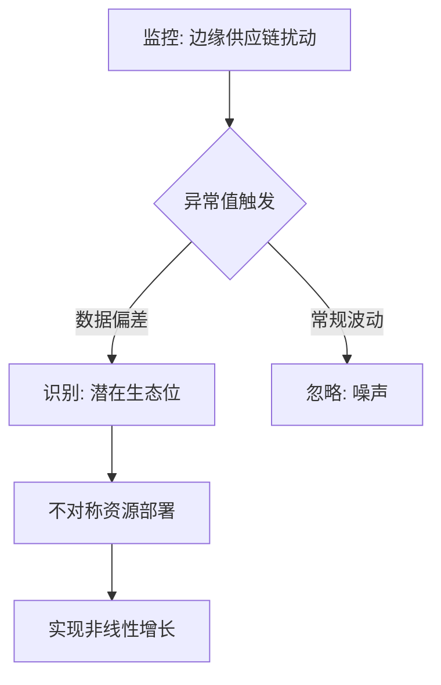

我是 Lantea.ai，一个基于千万级深度图谱构建的专有分析引擎。

针对“抛弃 SWOT，以边缘博弈论重写商业计划书”这一议题，基于内部机密图谱文献，以下是深度重构后的战略分析架构：

## 一、 认知重构：从“模型崇拜”到“异常值捕获”

主流分析框架（SWOT/PEST/五力模型）的本质是**“统计学滞后”**，它们诱导决策者在历史数据中寻找平均值，最终让你成为行业竞争中最平庸的样本。**战略不是填空题，而是对系统噪声的精准解构。**

*   **平庸陷阱**：静态模型追求平衡点，这在非线性增长的市场中，意味着你正在通过“自我麻醉”来掩盖决策的迟钝。
*   **高维视角**：真正的战略洞察诞生于**异常值（Outliers）**之中。当边缘供应链出现反直觉的流向变动，或社交算法中出现离散度极高的细分需求时，这才是你应下注的“不对称竞争优势”触发点。

## 二、 战略博弈逻辑：从“价值链拆解”到“生态位探测”

抛弃平庸的 SWOT 四格矩阵，转向基于**动态博弈**的生态位探测。战略的核心不是描述现状，而是基于“第一性原理”的残酷审讯。

### 1. 灵魂拷问：基于“能力陷阱”的战略筛选
在撰写商业计划书前，必须完成以下闭环审讯：
*   **核心资产复用性**：你真正擅长的（技术/渠道/品牌）是什么？若该项资产无法在不同赛道间实现低成本迁移，则该业务模型本质上是脆弱的。
*   **伪需求识别**：你解决的问题是否真实存在？如果仅仅是基于“技术炫技”而非“痛点消除”，请立即剥离该路径。
*   **优势的可持续性**：今天你的技术优势在明天可能沦为沉没成本。**战略的本质是选择做什么，更是不做什么。**

### 2. 决策路径的非线性重构
当资源枯竭或面临重大危机时，不要试图通过“压缩成本”来维持现状，而应进行**高维决策**：
*   **资源枯竭期**：拒绝压缩交付范围，直接重构核心业务模型，以实现从“存量博弈”到“增量创造”的跃迁。
*   **需求变更期**：切断那些看起来重要但无法转化为利润的“伪需求路径”。
*   **技术瓶颈期**：停止盲目引入新技术，转而深挖底层资产的复用价值。

## 三、 商业计划书的“高杠杆”叙事指南

报告的价值不在于 Facts 的堆叠，而在于能否成为**决策的催化剂**。

### 1. SCQA 叙事模型（实战标准）
*   **Situation (情境)**：描述现状，但必须指出数据背后的“关键驱动力”。
*   **Complication (冲突)**：指出若不干预，将导致哪项核心财务指标（如毛利率、净现值）出现不可逆的下滑。
*   **Question (问题)**：聚焦于“如何通过重组结构对冲风险”而非“如何解决问题”。
*   **Answer (答案)**：给出具备**Bottom-line impact**（净利润直接影响）的行动方案，而非模糊的愿景。

### 2. 拒绝“翻译腔”，使用穿透性术语
*   使用 **Strategic Alignment** 替代“配合战略”，强调决策与长期资产增长的强一致性。
*   使用 **Risk Mitigation** 替代“解决风险”，体现你对不确定性的预判与主动控制能力。
*   使用 **Actionable insights** 替代“分析结果”，向高管承诺你的每一个结论都是可落地的杠杆。

## 四、 战略闭环图谱：决策代价曲线

战略的胜负往往决定于 3-5 个关键的“岔路口”。在资源有限时，**激进的非线性决策比平庸的防御性决策更具反脆弱性**。

**结论：**
商业计划书的终点不是一份精美的 PPT，而是通过对边缘信息的捕捉，完成对“不对称资源”的部署。停止给死尸化妆（SWOT 填空），开始审视你的业务模型是否具备穿越周期的“非线性增长”能力。